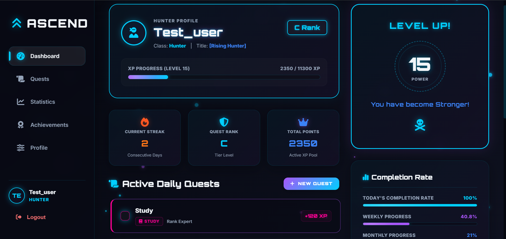
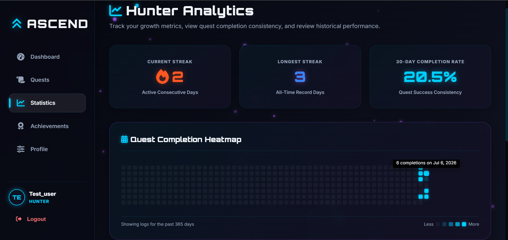
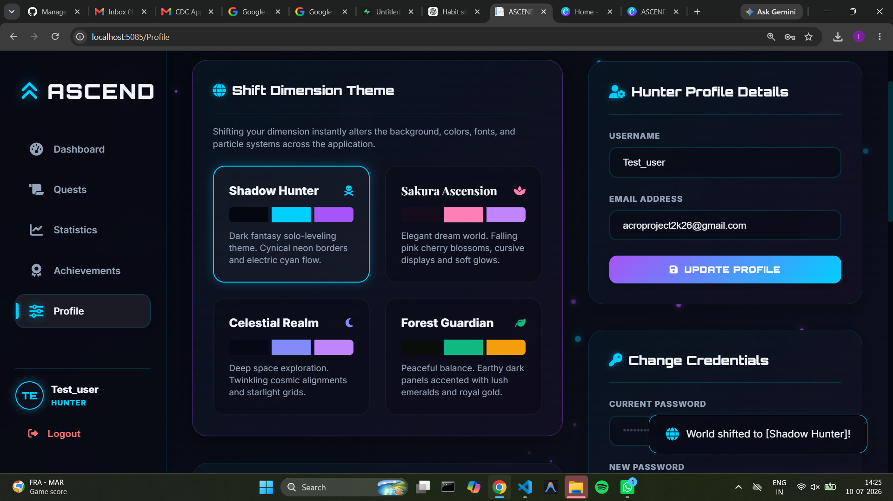
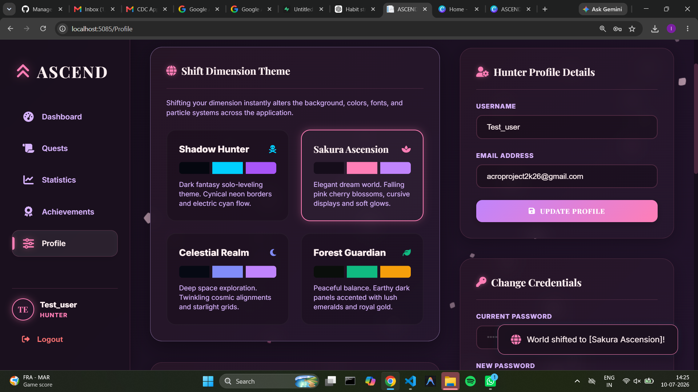
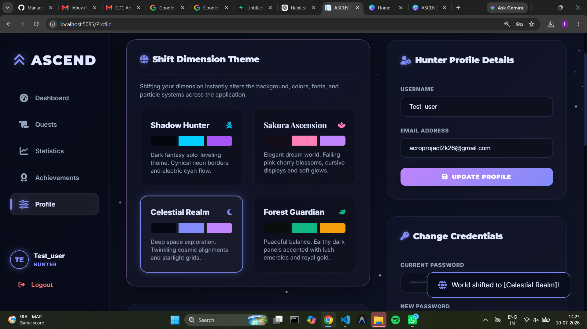
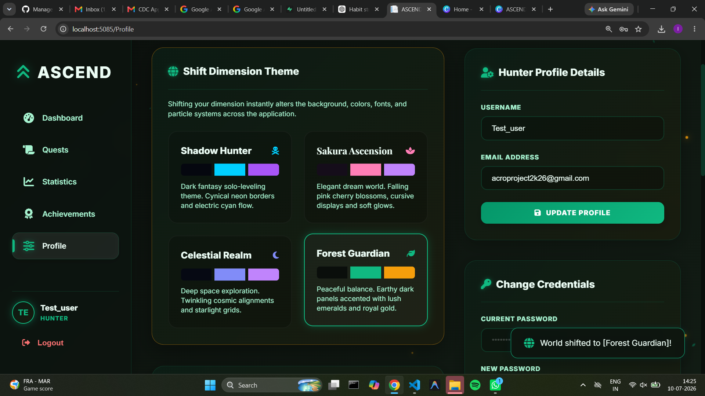

# ⚔️ ASCEND — Gamified Habit Streak Tracker

> Transform your daily habits into quests, build streaks, earn XP, unlock achievements, and ascend through the ranks.

ASCEND is a gamified habit-tracking web application built using ASP.NET Core MVC, C#, Entity Framework Core, and MySQL. It transforms traditional habit tracking into an RPG-inspired progression system where users complete daily quests, maintain streaks, earn XP, level up, unlock achievements, and personalize their experience using dynamic visual themes.

## 🌐 Live Demo

**ASCEND is deployed and available online:**

https://ascend-production-b221.up.railway.app/

## 📸 Screenshots

### Dashboard



### Statistics



## 🎨 Visual Themes

ASCEND provides four dynamic visual themes to improve personalization and user engagement.

### 🌑 Shadow Hunter

A dark fantasy interface inspired by RPG progression systems, featuring deep backgrounds, purple energy accents, and glowing interface elements.



### 🌸 Sakura Ascension

A soft Japanese fantasy-inspired interface featuring pink, rose, lavender, and cherry blossom elements.



### 🌌 Celestial Realm

A cosmic fantasy interface featuring deep space backgrounds, stars, purple accents, and mystical visual elements.



### 🌿 Forest Guardian

A nature-inspired interface featuring forest tones, emerald accents, and a calm fantasy atmosphere.



## ✨ Key Features

- User registration and login
- Secure password hashing using BCrypt
- Cookie-based authentication
- Create, edit, and manage habits
- Complete habits as daily quests
- Habit streak tracking
- XP reward system
- User level progression
- RPG-inspired rank system
- Achievement system
- Quest completion heatmap
- Weekly performance statistics
- Category distribution analytics
- User profile management
- Dynamic theme switching
- Four visual themes
- Responsive user interface
- Persistent MySQL database storage

## 🛠️ Technology Stack

### Backend

- C#
- .NET 8
- ASP.NET Core MVC

### Frontend

- HTML
- CSS
- JavaScript
- Razor Views
- Bootstrap

### Database

- MySQL
- Entity Framework Core
- Pomelo Entity Framework Core MySQL Provider

### Security

- BCrypt password hashing
- Cookie authentication

### Development & Deployment

- Visual Studio Code
- Git
- GitHub
- Railway

## 🏗️ System Architecture

ASCEND follows a layered ASP.NET Core MVC architecture.

```text
User
 │
 ▼
Razor Views
 │
 ▼
Controllers
 │
 ▼
Services
 │
 ▼
Repositories
 │
 ▼
Entity Framework Core
 │
 ▼
MySQL Database
```

### Controllers

Controllers receive requests from the user interface and coordinate application operations.

### Services

Services contain the primary business and gamification logic, including XP, streaks, ranks, and achievements.

### Repositories

Repositories manage database operations and provide separation between application logic and data access.

### Entity Framework Core

Entity Framework Core acts as the Object Relational Mapper between the C# application and MySQL database.

### ViewModels

ViewModels transfer the data required by Razor Views and help separate database models from UI-specific data.

## 📁 Project Structure

```text
ASCEND
│
├── Controllers
├── Data
├── Migrations
├── Models
├── Repositories
│   ├── Interfaces
│   └── Implementations
├── Services
│   ├── Interfaces
│   └── Implementations
├── ViewModels
├── Views
├── wwwroot
│   ├── css
│   └── js
├── ASCEND.csproj
├── Program.cs
└── README.md
```

## 🔄 Application Workflow

```text
User Registration / Login
          │
          ▼
      Dashboard
          │
          ▼
     Create Quest
          │
          ▼
    Complete Quest
          │
          ▼
   Save Habit Log
          │
          ▼
   Calculate Streak
          │
          ▼
      Award XP
          │
          ▼
 Check Level & Rank
          │
          ▼
 Check Achievements
          │
          ▼
 Update Statistics
```

## 🎮 Gamification System

The core feature of ASCEND is its RPG-inspired gamification system.

When users complete quests, the application:

- Records quest completion
- Updates the user's current streak
- Awards XP
- Checks level progression
- Updates user rank
- Checks achievement conditions
- Updates dashboard statistics

This approach encourages users to maintain consistency by providing visible progression and rewards.

## 💻 C# and .NET Concepts Demonstrated

The project demonstrates several important programming and software engineering concepts:

- Object-Oriented Programming
- Classes and Objects
- Encapsulation
- Interfaces
- Dependency Injection
- Repository Pattern
- Service Layer Pattern
- MVC Architecture
- LINQ
- Collections
- Exception Handling
- Asynchronous Programming
- Entity Framework Core
- CRUD Operations
- Authentication and Authorization

## 🗄️ Database Design

The primary database entities include:

- Users
- Habits
- HabitLogs
- Achievements
- UserAchievements

Entity Framework Core is used to manage database operations and migrations.

## 🚀 Local Installation

### Prerequisites

Install:

- .NET 8 SDK
- MySQL Server
- Git

### Clone the Repository

```bash
git clone https://github.com/bhagyesh-jain/ASCEND.git
cd ASCEND
```

### Restore Dependencies

```bash
dotnet restore
```

### Configure the Database

Configure `DefaultConnection` using local development configuration or .NET User Secrets.

Example connection string:

```text
Server=localhost;Port=3306;Database=ascend_db;User Id=root;Password=YOUR_PASSWORD;
```

Do not commit real database credentials to GitHub.

### Apply Database Migrations

```bash
dotnet ef database update
```

### Run the Application

```bash
dotnet run
```

Open the localhost address displayed in the terminal.

## ☁️ Deployment

ASCEND is deployed using Railway.

```text
GitHub Repository
        │
        ▼
Railway ASP.NET Core Service
        │
        ▼
Entity Framework Core
        │
        ▼
Railway MySQL Database
```

Production database credentials are provided through Railway environment variables rather than being stored in the source code.

## 🔮 Future Enhancements

- Quest reminder notifications
- Advanced achievements
- Social leaderboard
- Friend challenges
- Custom user-created themes
- Improved mobile interface
- Progressive Web App support
- Advanced statistics and insights

## 🎓 Academic Purpose

ASCEND was developed as a college mini-project to demonstrate the practical implementation of C#, .NET, ASP.NET Core MVC, Object-Oriented Programming, database management, and modern web application development.

## 👨‍💻 Author

**Bhagyesh Jain**

---

⭐ If you found this project interesting, consider giving the repository a star.